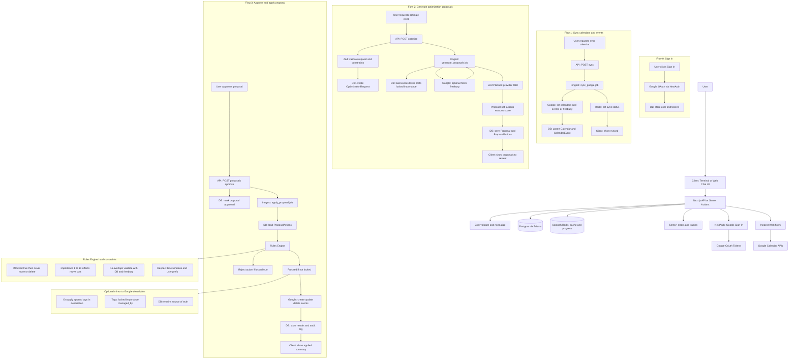

# AI Scheduler App Flowchart (V1)

```mermaid
flowchart TD
  %% Actors / Systems
  U[User] --> C[Client: Terminal or Web Chat UI]
  C --> API[Next.js API or Server Actions]

  API --> AUTH[NextAuth: Google Sign-In]
  AUTH --> TOK[Google OAuth Tokens]

  API --> VAL[Zod: validate and normalize]
  API --> DB[(Postgres via Prisma)]
  API --> REDIS[(Upstash Redis: cache and progress)]
  API --> SENTRY[Sentry: errors and tracing]

  API --> JOBS[Inngest Workflows]
  JOBS --> GOOGLE[Google Calendar APIs]

  %% Flow 0: Sign in
  subgraph F0[Flow 0: Sign in]
    direction TB
    F0A[User clicks Sign In] --> F0B[Google OAuth via NextAuth]
    F0B --> F0C[DB: store user and tokens]
  end

  %% Flow 1: Sync calendars and events
  subgraph F1[Flow 1: Sync calendars and events]
    direction TB
    F1A[User requests sync calendar] --> F1B[API: POST sync]
    F1B --> F1C[Inngest: sync_google job]
    F1C --> F1D[Google: list calendars and events or freebusy]
    F1D --> F1E[DB: upsert Calendar and CalendarEvent]
    F1C --> F1F[Redis: set sync status]
    F1F --> F1G[Client: show synced]
  end

  %% Flow 2: Chat request -> generate proposals
  subgraph F2[Flow 2: Generate optimization proposals]
    direction TB
    F2A[User requests optimize week] --> F2B[API: POST optimize]
    F2B --> F2C[Zod: validate request and constraints]
    F2C --> F2D[DB: create OptimizationRequest]
    F2B --> F2E[Inngest: generate_proposals job]

    F2E --> F2F[DB: load events tasks prefs locked importance]
    F2E --> F2G[Google: optional fresh freebusy]
    F2G --> F2E

    F2E --> F2H[LLM Planner: provider TBD]
    F2H --> F2I[Proposal set: actions reasons score]
    F2I --> F2J[DB: save Proposal and ProposalActions]
    F2J --> F2K[Client: show proposals to review]
  end

  %% Flow 3: Approve -> apply changes to Google
  subgraph F3[Flow 3: Approve and apply proposal]
    direction TB
    F3A[User approves proposal] --> F3B[API: POST proposals approve]
    F3B --> F3C[DB: mark proposal approved]
    F3B --> F3D[Inngest: apply_proposal job]

    F3D --> F3E[DB: load ProposalActions]
    F3E --> RULES[Rules Engine]
    RULES --> STOP[Reject action if locked true]
    RULES --> DO[Proceed if not locked]

    DO --> F3F[Google: create update delete events]
    F3F --> F3G[DB: store results and audit log]
    F3G --> F3H[Client: show applied summary]
  end

  %% Rules Engine details
  subgraph RE[Rules Engine hard constraints]
    direction TB
    RE1[If locked true then never move or delete]
    RE2[importance 1 to 10 affects move cost]
    RE3[No overlaps validate with DB and freebusy]
    RE4[Respect time windows and user prefs]
  end

  RULES --> RE

  %% Optional: mirror metadata into Google event description
  subgraph META[Optional mirror to Google description]
    direction TB
    M1[On apply append tags in description]
    M2[Tags: locked importance managed_by]
    M3[DB remains source of truth]
  end

  DO --> META
```